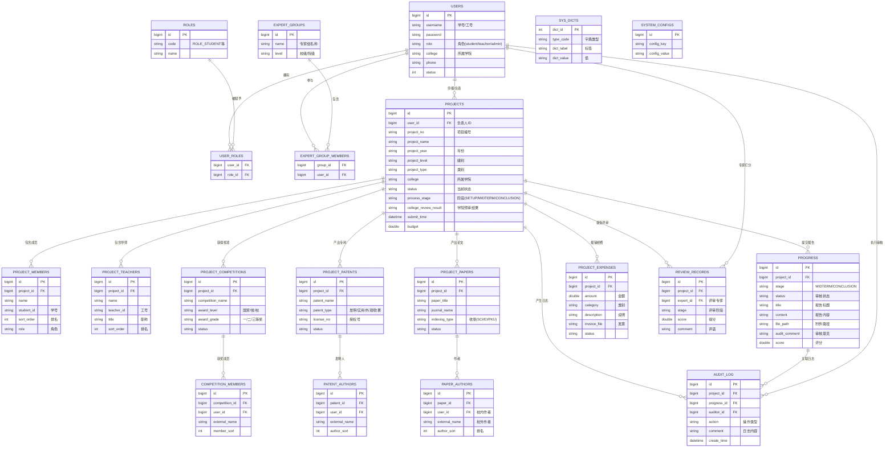

```mermaid
erDiagram
    %% ==========================================
    %% 1. 用户与权限模块
    %% ==========================================
    USERS {
        bigint id PK
        string username "学号/工号"
        string password
        string role "角色(student/teacher/admin)"
        string college "所属学院"
        string phone
        int status
    }
    ROLES {
        bigint id PK
        string code "ROLE_STUDENT等"
        string name
    }
    USER_ROLES {
        bigint user_id FK
        bigint role_id FK
    }
    EXPERT_GROUPS {
        bigint id PK
        string name "专家组名称"
        string level "校级/院级"
    }
    EXPERT_GROUP_MEMBERS {
        bigint group_id FK
        bigint user_id FK
    }

    USERS ||--o{ USER_ROLES : "拥有"
    ROLES ||--o{ USER_ROLES : "被赋予"
    USERS ||--o{ EXPERT_GROUP_MEMBERS : "参与"
    EXPERT_GROUPS ||--o{ EXPERT_GROUP_MEMBERS : "包含"

    %% ==========================================
    %% 2. 项目基础模块
    %% ==========================================
    PROJECTS {
        bigint id PK
        bigint user_id FK "负责人ID"
        string project_no "项目编号"
        string project_name
        string project_year "年份"
        string project_level "级别"
        string project_type "类别"
        string college "所属学院"
        string status "当前状态"
        string process_stage "阶段(SETUP/MIDTERM/CONCLUSION)"
        string college_review_result "学院预审结果"
        datetime submit_time
        double budget
    }
    PROJECT_MEMBERS {
        bigint id PK
        bigint project_id FK
        string name
        string student_id "学号"
        int sort_order "排名"
        string role "角色"
    }
    PROJECT_TEACHERS {
        bigint id PK
        bigint project_id FK
        string name
        string teacher_id "工号"
        string title "职称"
        int sort_order "排名"
    }

    USERS ||--o{ PROJECTS : "申报/负责"
    PROJECTS ||--o{ PROJECT_MEMBERS : "包含成员"
    PROJECTS ||--o{ PROJECT_TEACHERS : "包含导师"

    %% ==========================================
    %% 3. 过程管理模块 (中期/结题)
    %% ==========================================
    PROGRESS {
        bigint id PK
        bigint project_id FK
        string stage "MIDTERM/CONCLUSION"
        string status "审核状态"
        string title "报告标题"
        string content "报告内容"
        string file_path "附件路径"
        string audit_comment "审核意见"
        double score "评分"
    }
    AUDIT_LOG {
        bigint id PK
        bigint project_id FK
        bigint progress_id FK
        bigint auditor_id FK
        string action "操作类型"
        string comment "日志内容"
        datetime create_time
    }

    PROJECTS ||--o{ PROGRESS : "提交报告"
    PROJECTS ||--o{ AUDIT_LOG : "产生日志"
    PROGRESS ||--o{ AUDIT_LOG : "关联日志"
    USERS ||--o{ AUDIT_LOG : "执行审核"

    %% ==========================================
    %% 4. 成果管理模块 (细化)
    %% ==========================================
    PROJECT_PAPERS {
        bigint id PK
        bigint project_id FK
        string paper_title
        string journal_name
        string indexing_type "收录(SCI/EI/PKU)"
        string status
    }
    PAPER_AUTHORS {
        bigint id PK
        bigint paper_id FK
        bigint user_id FK "校内作者"
        string external_name "校外作者"
        int author_sort "排名"
    }

    PROJECT_PATENTS {
        bigint id PK
        bigint project_id FK
        string patent_name
        string patent_type "发明/实用/外观/软著"
        string license_no "授权号"
        string status
    }
    PATENT_AUTHORS {
        bigint id PK
        bigint patent_id FK
        bigint user_id FK
        string external_name
        int author_sort
    }

    PROJECT_COMPETITIONS {
        bigint id PK
        bigint project_id FK
        string competition_name
        string award_level "国家/省/校"
        string award_grade "一/二/三等奖"
        string status
    }
    COMPETITION_MEMBERS {
        bigint id PK
        bigint competition_id FK
        bigint user_id FK
        string external_name
        int member_sort
    }

    PROJECTS ||--o{ PROJECT_PAPERS : "产出论文"
    PROJECT_PAPERS ||--o{ PAPER_AUTHORS : "作者"
    PROJECTS ||--o{ PROJECT_PATENTS : "产出专利"
    PROJECT_PATENTS ||--o{ PATENT_AUTHORS : "发明人"
    PROJECTS ||--o{ PROJECT_COMPETITIONS : "获得奖项"
    PROJECT_COMPETITIONS ||--o{ COMPETITION_MEMBERS : "获奖成员"

    %% ==========================================
    %% 5. 经费与评审
    %% ==========================================
    PROJECT_EXPENSES {
        bigint id PK
        bigint project_id FK
        double amount "金额"
        string category "类别"
        string description "说明"
        string invoice_file "发票"
        string status
    }

    REVIEW_RECORDS {
        bigint id PK
        bigint project_id FK
        bigint expert_id FK "评审专家"
        string stage "评审阶段"
        double score "得分"
        string comment "评语"
    }

    PROJECTS ||--o{ PROJECT_EXPENSES : "报销经费"
    PROJECTS ||--o{ REVIEW_RECORDS : "接受评审"
    USERS ||--o{ REVIEW_RECORDS : "专家打分"
    
    %% ==========================================
    %% 6. 系统配置
    %% ==========================================
    SYS_DICTS {
        int dict_id PK
        string type_code "字典类型"
        string dict_label "标签"
        string dict_value "值"
    }
    SYSTEM_CONFIGS {
        bigint id PK
        string config_key
        string config_value
    }

```